# Telegram Bridge Setup

Complete guide to set up automatic AI responses for Telegram messages using Antigravity IDE models.

## Table of Contents
1. [Architecture Overview](#architecture-overview)
2. [Prerequisites](#prerequisites)
3. [Phase 1: Proxy Installation](#phase-1-proxy-installation)
4. [Phase 2: OpenClaw Installation](#phase-2-openclaw-installation)
5. [Phase 3: Configuration](#phase-3-configuration)
6. [Phase 4: Gateway Startup](#phase-4-gateway-startup)
7. [Phase 5: Telegram Pairing](#phase-5-telegram-pairing)
8. [Daily Operations](#daily-operations)
9. [Troubleshooting](#troubleshooting)
10. [Reference Files](#reference-files)

---

## Architecture Overview

```mermaid
graph LR
    Telegram([📱 Telegram Message]) -->|Port 18789| Gateway[🦞 OpenClaw Gateway]
    Gateway -->|Port 8080| Proxy[🔌 antigravity-claude-proxy]
    Proxy --> IDE([🤖 Antigravity IDE Models])
    IDE --> Proxy
    Proxy --> Gateway
    Gateway -->|Auto-Reply| Telegram
```



**Components:**
| Component | Role | Port |
|-----------|------|------|
| [antigravity-claude-proxy](https://github.com/badrisnarayanan/antigravity-claude-proxy) | Exposes IDE models as OpenAI-compatible API | 8080 |
| [OpenClaw Gateway](https://github.com/openclaw/openclaw) | Bridges Telegram to AI backend | 18789 |
| Antigravity IDE | Provides Claude/Gemini models | N/A |

---

## Prerequisites

### Automated Setup (Recommended)
**Run from the project root directory:**

```powershell
powershell -ExecutionPolicy Bypass -File ".\install\check_env.ps1"
```

This script will install:
- **Node.js** (LTS)
- **Git**
- **Python** (3.12 or higher)

### Manual Setup (If Script Fails)
- **Node.js** v18.0.0 or higher
- **Git** (for cloning repositories)
- **Python** v3.12 or higher (Check with `python --version`)
- **Antigravity IDE** running with logged-in account

### Required Credentials
- **Telegram Bot Token** from [@BotFather](https://t.me/BotFather)

### How to Get Telegram Bot Token
1. Open Telegram and search for `@BotFather`
2. Send `/newbot` command
3. Follow prompts to name your bot
4. Copy the API token (format: `1234567890:ABCdefGHIjklMNOpqrsTUVwxyz`)

---

## Phase 1: Proxy Installation

### Step 1.1: Clone Repository (Optional - for reference)
```powershell
git clone https://github.com/badrisnarayanan/antigravity-claude-proxy.git
```

### Step 1.2: Install Globally
// turbo
```powershell
npm install -g antigravity-claude-proxy@latest
```

### Step 1.3: Restore Credentials (Optional)
If you have backed up credentials in `credentials\proxy-accounts.json`, restore them now:

```powershell
if (Test-Path ".\credentials\proxy-accounts.json") {
    $Dest = "$env:USERPROFILE\.config\antigravity-proxy"
    New-Item -ItemType Directory -Path $Dest -Force | Out-Null
    Copy-Item ".\credentials\proxy-accounts.json" "$Dest\accounts.json" -Force
    Write-Host "✅ Credentials restored."
} else {
    Write-Host "ℹ️  No credential backup found. Skipping restore."
}
```

### Step 1.4: Start Proxy Server
```powershell
antigravity-claude-proxy start
```

> ⚠️ **Keep this terminal window open** - closing it stops the proxy.

### Step 1.4: Verify Installation
1. Open browser: `http://localhost:8080`
2. Check **Dashboard** tab: Total Accounts: 1+, Active: 1+
3. Check **Accounts** tab: Status should show "Operational" (green)

### Step 1.5: Link Account (if not auto-detected)
1. Go to **Accounts** tab -> **"Add Account"** -> **"Connect Google Account"**
2. Complete OAuth flow -> Verify account shows "Operational"

### Step 1.6: Verify Available Models
1. Go to **Models** tab
2. Confirm models are available (`claude-sonnet-4-5`, `gemini-3-flash`) and check quota percentages.

---

## Phase 2: OpenClaw Installation

### Step 2.1: Install Globally
// turbo
```powershell
npm install -g openclaw@latest
```

### Step 2.2: Run Doctor (Directory Setup)
```powershell
openclaw doctor
```

**Interactive Prompts:**
- "Generate and configure a gateway token now?": **Yes (Enter)**
- "Create C:\Users\{USER}\.openclaw now?": **Yes (y)**
- "Create Session store dir...?": **Yes (Enter)**
- "Create OAuth dir...?": **Yes (Enter)**
- "Enable zsh shell completion...?": **No (n)**
- "Install gateway service now?": **No (n)**

### Step 2.3: Run Onboard (Telegram Setup)
```powershell
openclaw onboard
```

**Interactive Prompts:**
- "Onboarding mode": **QuickStart**
- "Model/auth provider": **Anthropic** (API Key -> `test`)
- "Default model": **Keep current**
- "Select channel": **Telegram (Bot API)** -> **Paste your Bot Token**
- "Configure skills now?": **No (n)**

---

## Phase 3: Configuration

### Step 3.1: Locate Config File
```powershell
# Windows path: %USERPROFILE%\.openclaw\openclaw.json
code $env:USERPROFILE\.openclaw\openclaw.json
```

### Step 3.2: Complete Configuration Template

Replace entire file content with this template:

```json
{
  "messages": { "ackReactionScope": "group-mentions" },
  "models": {
    "mode": "merge",
    "providers": {
      "antigravity-proxy": {
        "baseUrl": "http://127.0.0.1:8080", "apiKey": "test", "api": "anthropic-messages",
        "models": [ { "id": "claude-sonnet-4-5", "name": "Claude Sonnet 4.5 (Proxy)" }, { "id": "gemini-3-flash", "name": "Gemini 3 Flash (Proxy)" } ]
      }
    }
  },
  "agents": {
    "defaults": {
      "maxConcurrent": 4,
      "model": { "primary": "antigravity-proxy/claude-sonnet-4-5" },
      "subagents": { "maxConcurrent": 8 },
      "compaction": { "mode": "safeguard" },
      "workspace": "C:\\Users\\YOUR_USERNAME\\.openclaw\\workspace"
    }
  },
  "gateway": {
    "mode": "local",
    "auth": { "mode": "token", "token": "YOUR_GATEWAY_TOKEN_FROM_ONBOARD" },
    "port": 18789,
    "bind": "loopback",
    "tailscale": { "mode": "off", "resetOnExit": false }
  },
  "auth": { "profiles": { "anthropic:default": { "provider": "anthropic", "mode": "api_key" } } },
  "plugins": { "entries": { "telegram": { "enabled": true } } },
  "channels": { "telegram": { "enabled": true, "botToken": "YOUR_TELEGRAM_BOT_TOKEN" } },
  "wizard": { "lastRunAt": "2026-02-07T00:00:00.000Z", "lastRunVersion": "2026.2.3-1", "lastRunCommand": "onboard", "lastRunMode": "local" },
  "meta": { "lastTouchedVersion": "2026.2.3-1", "lastTouchedAt": "2026-02-07T00:00:00.000Z" }
}
```

### Step 3.3: Required Replacements
| Placeholder | Replace With | Example |
|-------------|--------------|---------|
| `YOUR_USERNAME` | Windows username | `Lemos` |
| `YOUR_GATEWAY_TOKEN_FROM_ONBOARD` | Token from onboard/env | `e42a75fc83...` |
| `YOUR_TELEGRAM_BOT_TOKEN` | BotFather token | `841366...` |

### Step 3.4: Critical Configuration Notes
> ⚠️ **MUST USE `127.0.0.1`** - Do NOT use `localhost`!
> DNS resolution issues cause connection failures with `localhost`.
> ⚠️ Do NOT add `inputTypes`, `reasoning`, or `contextWindow` fields.

---

## Phase 4: Gateway Startup

### Step 4.1: Open New Terminal
Keep the proxy terminal open and open a **second** terminal.

### Step 4.2: Start Gateway
```powershell
openclaw gateway run
```

### Step 4.3: Verify Startup
Success logs should show: `[telegram] starting provider (@YOUR_BOT_NAME)`

> ⚠️ **Keep this terminal window open** - closing it stops the gateway.

---

## Phase 5: Telegram Pairing

### Step 5.1: Initiate Pairing
1. Open Telegram -> Find your bot -> Send "hello".

### Step 5.2: Receive Pairing Code
Bot will reply: `Pairing code: XXXXXXXX`

### Step 5.3: Approve Pairing
Run in terminal:
```powershell
openclaw pairing approve telegram <PAIRING_CODE>
```

### Step 5.4: Verify Success
Send another message to your bot → Receive AI auto-response!

---

## Daily Operations

### Startup Sequence
**Terminal 1 - Proxy:** `antigravity-claude-proxy start`
**Terminal 2 - Gateway:** `openclaw gateway run`

### Shutdown Sequence
Press `Ctrl+C` in each terminal to gracefully stop.

### Quick Status Check
```powershell
# Check proxy status
curl http://localhost:8080/health
# Check channels
openclaw channels status
```

---

## Troubleshooting

### HTTP 401: invalid x-api-key
**Solution:** Verify `models.providers.antigravity-proxy` section exists in config

### Connection Refused
**Solution:** Start proxy before gateway: `antigravity-claude-proxy start`

### Invalid Config Error
**Solution:** Remove `inputTypes`, `reasoning`, `contextWindow` from models array

### Pairing Required Message
**Solution:** Run `openclaw pairing approve telegram <CODE>`

### localhost Connection Fails
**Solution:** Use `127.0.0.1` instead of `localhost` in config

### No Models Available in Proxy
**Solution:** Open `http://localhost:8080` -> Accounts -> Add Account -> Complete Google OAuth

---

## Reference Files

### Credentials Storage
`credentials/telegram-bridge.env`

### Configuration File
`%USERPROFILE%\.openclaw\openclaw.json`

### Proxy Dashboard
`http://localhost:8080`

### Important Ports
| Service | Port |
|---------|------|
| Proxy Server | 8080 |
| Proxy Dashboard | 8080 |
| OpenClaw Gateway | 18789 |

---

## Quick Reference Card

1. **Terminal 1:** `antigravity-claude-proxy start`
2. **Terminal 2:** `openclaw gateway run`
3. **First-time only:** Send message to bot -> `openclaw pairing approve telegram <CODE>`

---

## Backup & Restore

### Backing up Credentials
The proxy stores account connections (including OAuth tokens) in a JSON file.
Backup this file to save your logged-in accounts:

```powershell
Copy-Item -Path "$env:USERPROFILE\.config\antigravity-proxy\accounts.json" -Destination ".\credentials\proxy-accounts.json"
```

### Restoring Credentials
To restore your accounts on a new machine or session:

```powershell
# Create config directory if it doesn't exist
New-Item -ItemType Directory -Path "$env:USERPROFILE\.config\antigravity-proxy" -Force

# Restore file
Copy-Item -Path ".\credentials\proxy-accounts.json" -Destination "$env:USERPROFILE\.config\antigravity-proxy\accounts.json" -Force
```
