# Telegram Bridge Setup (Gemini CLI Edition)

Complete guide to set up automatic AI responses for Telegram messages using Google's Gemini CLI directly.

## Table of Contents
1. [Architecture Overview](#architecture-overview)
2. [Prerequisites](#prerequisites)
3. [Phase 1: Gemini CLI Installation](#phase-1-gemini-cli-installation)
4. [Phase 2: OpenClaw Installation & Patching](#phase-2-openclaw-installation--patching)
5. [Phase 3: Configuration](#phase-3-configuration)
6. [Phase 4: Gateway Startup](#phase-4-gateway-startup)
7. [Phase 5: Verification](#phase-5-verification)
8. [Daily Operations](#daily-operations)
9. [Troubleshooting](#troubleshooting)

---

## Architecture Overview

```mermaid
graph LR
    Telegram([📱 Telegram Message]) -->|Port 18789| Gateway[🦞 OpenClaw Gateway]
    Gateway -->|Shell Execution| CLI[⚡ @google/gemini-cli]
    CLI -->|OAuth| GoogleCloud([☁️ Google Cloud])
    Gateway -->|Auto-Reply| Telegram
```



**Components:**
| Component | Role | Port |
|-----------|------|------|
| [OpenClaw Gateway](https://github.com/openclaw/openclaw) | Bridges Telegram to AI backend | 18789 |
| [@google/gemini-cli](https://www.npmjs.com/package/@google/gemini-cli) | Direct interface to Gemini models | N/A |

---

## Prerequisites

### Required Software
- **Node.js**: v18.0.0 or higher (LTS recommended)
- **Telegram Bot Token**: Get from [@BotFather](https://t.me/BotFather)

### Quick Check
```powershell
node -v
npm -v
```

---

## Phase 1: Gemini CLI Installation

### Step 1.1: Install Globally
// turbo
```powershell
npm install -g @google/gemini-cli
```

### Step 1.2: Verify Installation & Path (Windows Critical)
After installation, you **MUST** restart your terminal to ensure the command is found.

```powershell
# Check if command works
gemini --help
```

> ⚠️ **Windows Note:** If `gemini` command is not found, ensure `%AppData%\npm` is in your environment PATH.

---

## Phase 2: OpenClaw Installation & Patching

### Step 2.1: Install OpenClaw
// turbo
```powershell
npm install -g openclaw@latest
```

### Step 2.2: Patch for Windows (Critical Fix)
Currently, OpenClaw has a path resolution bug on Windows with the Gemini CLI extension. You must apply this manual patch if you see "Gemini CLI not found".

**File:** `%AppData%\npm\node_modules\openclaw\extensions\google-gemini-cli-auth\oauth.ts` (or equivalent `dist` JS file if running compiled)

**The Fix:**
Locate the `extractGeminiCliCredentials` function and update the path resolution logic:

```typescript
// OLD (Buggy on Windows):
const geminiCliDir = dirname(dirname(resolvedPath));

// NEW (Fixed):
const binDir = dirname(resolvedPath);
let geminiCliDir = dirname(binDir);
const npmGlobalCliDir = join(binDir, "node_modules", "@google", "gemini-cli");
if (existsSync(npmGlobalCliDir)) {
  geminiCliDir = npmGlobalCliDir;
}
```

---

## Phase 3: Configuration

### Step 3.1: Run Onboard
```powershell
openclaw onboard
```
*Follow prompts to set up the basic directory structure. When asked for provider, you can select any dummy value as we will overwrite the config.*

### Step 3.2: Configure `openclaw.json`
**Location:** `%USERPROFILE%\.openclaw\openclaw.json`

Replace contents with this verify configuration:

```json
{
  "browser": {
    "enabled": true,
    "defaultProfile": "openclaw"
  },
  "auth": {
    "profiles": {
      "google-gemini-cli:default": {
        "provider": "google-gemini-cli",
        "mode": "oauth",
        "email": "YOUR_GMAIL@gmail.com"
      }
    }
  },
  "agents": {
    "defaults": {
      "model": {
        "primary": "google-gemini-cli/gemini-3-flash-preview"
      },
      "models": {
        "google-gemini-cli/gemini-3-pro-preview": {},
        "google-gemini-cli/gemini-3-flash-preview": {}
      }
    }
  },
  "channels": {
    "telegram": {
      "enabled": true,
      "dmPolicy": "open",
      "botToken": "YOUR_TELEGRAM_BOT_TOKEN",
      "groupPolicy": "disabled",
      "allowFrom": ["*"],
      "streamMode": "partial"
    }
  },
  "plugins": {
    "entries": {
      "telegram": { "enabled": true },
      "google-gemini-cli-auth": { "enabled": true }
    }
  }
}
```

### Step 3.3: Critical Configuration Rules
1. **`dmPolicy`: "open"** - Allows anyone to message the bot (easiest for testing).
2. **`groupPolicy`: "disabled"** - Must be explicitly set to "disabled" or "allowlist" to avoid validation errors.
3. **`allowFrom`: ["*"]** - Required when `dmPolicy` is "open".
4. **`browser` Block**: Must be at the **root level** (not inside plugins).

### Step 3.4: Browser Configuration Check
OpenClaw includes a browser automation plugin. Verify it detects your browser (Chrome/Edge):

```powershell
openclaw browser --browser-profile openclaw status
```
*Expected Output: "Status: healthy", "detectedPath: ...chrome.exe"*

---

## Phase 4: Gateway Startup

### Step 4.1: Kill Zombie Processes
Ensure no previous implementation is hugging the port:
```powershell
taskkill /F /IM node.exe
```

### Step 4.2: Start Gateway
```powershell
openclaw gateway run
```

### Step 4.3: Authenticate
On first run, a browser window will open for **Google OAuth**.
1. Sign in with your Google Account.
2. Grant permissions to Gemini CLI.
3. Return to terminal - it should say "Connected".

---

## Phase 5: Verification

1. Open Telegram.
2. Search for your bot.
3. Send message: `gd` (or "hello").
4. Bot should reply with a Gemini-generated response.

---

## Daily Operations

### Startup
Only one command needed:
```powershell
openclaw gateway run
```

---

## Troubleshooting

### "Gemini CLI not found"
**Cause:** Path issue or Windows shim handling.
**Fix:** Apply the patch in Phase 2.2 and restart terminal.

### "Invalid config at ... dmPolicy"
**Cause:** Using "public" instead of "open".
**Fix:** Set `"dmPolicy": "open"`.

### Gateway exits immediately with code 1
**Cause:** Port 18789 is in use (EADDRINUSE).
**Fix:** Run `netstat -ano | findstr 18789` and kill the PID found.
