# Telegram Bridge Setup (OpenAI Codex Edition)

Comprehensive guide to integrating Telegram with OpenAI's advanced Codex models (`gpt-5.3-codex`) using OpenClaw. This setup leverages Browser-based OAuth for authentication and supports variable "Reasoning Effort" levels for optimized responses.

## Table of Contents
1. [Architecture Overview](#architecture-overview)
2. [Prerequisites](#prerequisites)
3. [Phase 1: Onboarding & Authentication](#phase-1-onboarding--authentication)
4. [Phase 2: Configuration Deep Dive](#phase-2-configuration-deep-dive)
5. [Phase 3: Reasoning & Effort Settings](#phase-3-reasoning--effort-settings)
6. [Daily Operations](#daily-operations)
7. [Troubleshooting](#troubleshooting)

---

## Architecture Overview

```mermaid
graph LR
    Telegram([📱 Telegram Message]) -->|WebHook| Gateway[🦞 OpenClaw Gateway]
    Gateway -->|OAuth 2.0| OpenAI[☁️ OpenAI Codex API]
    OpenAI -->|Context 266k| Model[🧠 GPT-5.3 Codex]
    Model -->|Reasoning| Thinking[💡 Chain of Thought]
    Thinking -->|Response| Gateway
    Gateway -->|Auto-Reply| Telegram
```



**Key Components:**
- **OpenClaw Gateway**: Local server management (Port 18789).
- **OpenAI Codex**: Cloud-based AI provider (Requires Internet).
- **OAuth Strategy**: Uses "ChatGPT OAuth" profile (`openai-codex`), eliminating the need for raw API keys.

---

## Prerequisites

### 1. Telegram Bot Token
- **Source**: [@BotFather](https://t.me/BotFather)
- **Command**: `/newbot`
- **Output**: HTTP API Token (e.g., `123456789:ABC...`)

### 2. OpenAI Access
- **Account**: Active OpenAI account.
- **Access**: Must have access to `gpt-5.3-codex` or `gpt-5.1-codex`.
- **Note**: No manual API Key generation is required; the bridge uses browser-based login.

---

## Phase 1: Onboarding & Authentication

The `onboard` wizard is the safest way to establish the initial OAuth connection.

```powershell
openclaw onboard
```

### Wizard Walkthrough
1.  **Risk Warning**: Select `Yes`.
2.  **Mode**: Select `QuickStart`.
3.  **Config Handling**: Select `Update values` (if re-configuring).
4.  **Provider**: Select `OpenAI (Codex OAuth + API key)`.
5.  **Auth Method**: **CRITICAL** - Select `OpenAI Codex (ChatGPT OAuth)`.
    *   *A browser window will open.*
    *   *Log in to OpenAI and authorize the application.*
    *   *Return to terminal after success message.*
6.  **Model**: Select `openai-codex/gpt-5.3-codex` (Reasoning capable).
7.  **Channel**: Select `Telegram` and input your Bot Token.

---

## Phase 2: Configuration Deep Dive

For granular control, edit the configuration file directly.

**File Location:** `%USERPROFILE%\.openclaw\openclaw.json`

### Recommended Configuration
```json
{
  "agents": {
    "defaults": {
      "model": {
        "primary": "openai-codex/gpt-5.3-codex"
      },
      "//_comment": "Controls thinking effort: off | minimal | low | medium | high | xhigh",
      "thinkingDefault": "minimal",
      "maxConcurrent": 4,
      "workspace": "C:\\Users\\Lemos\\.openclaw\\workspace",
      "models": {
        "openai-codex/gpt-5.3-codex": {}
      }
    }
  },
  "auth": {
    "profiles": {
      "openai-codex:default": {
        "provider": "openai-codex",
        "mode": "oauth"
      }
    }
  },
  "channels": {
    "telegram": {
      "enabled": true,
      "botToken": "YOUR_BOT_TOKEN_HERE",
      "dmPolicy": "open",
      "streamMode": "partial"
    }
  }
}
```

---

## Phase 3: Reasoning & Effort Settings

OpenAI Codex models support "Thinking" (Reasoning Effort), allowing the model to plan before answering. This trades speed for quality.

| Level | Latency | Use Case |
|-------|---------|----------|
| `off` | Instant | Simple chat, greetings |
| `minimal` | Fast (<5s) | **Recommended** for Telegram chat |
| `low` | Standard | Default coding tasks |
| `medium` | Slow (~15s) | Complex refactoring |
| `high` | Slower (~30s) | Architecture planning |
| `xhigh` | Very Slow (~60s+) | **GPT-5.3 Only**. Research & Deep Debugging |

### Changing Effort Level
Update the `thinkingDefault` key in `openclaw.json`:
```json
"thinkingDefault": "xhigh"
```
*Note: High effort levels may cause Telegram timeouts if the model takes too long to respond.*

---

## Daily Operations

### Start Gateway
```powershell
openclaw gateway run
```

### Restart Gateway (Apply Config Changes)
```powershell
taskkill /F /IM "node.exe"
openclaw gateway run
```

### Update/Refresh Credentials
If the bot stops responding due to auth expiry:
```powershell
openclaw auth login --provider openai-codex
```

---

## Troubleshooting

### ❌ Telegram "Thinking..." then no reply
**Cause**: The model is taking too long to 'think', causing a webhook timeout.
**Fix**: Lower the `thinkingDefault` to `minimal` or `low`.

### ❌ "No API key found for provider 'openai'"
**Cause**: Config mismatch. You are using `openai` (API Key) provider instead of `openai-codex` (OAuth).
**Fix**: Ensure `defaults.model.primary` is set to `openai-codex/gpt-5.3-codex`.

### ❌ "HTTP 401 Unauthorized"
**Cause**: OAuth token has expired.
**Fix**: Run `openclaw auth login --provider openai-codex` to refresh the token via browser.
