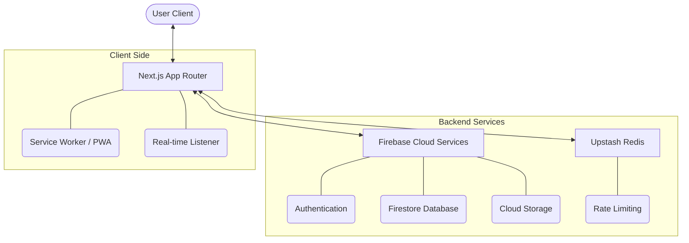

# 🍽️ Family Meal Tracker

가족들과 함께 나누는 맛있는 추억을 기록하고 관리하는 Next.js 기반의 스마트 식사 기록 플랫폼입니다.

[](https://nextjs.org/)
[](https://firebase.google.com/)
[](https://www.typescriptlang.org/)
[](https://react.dev/)
[](https://web.dev/progressive-web-apps/)
[](https://github.com/mjuik98/FamilyMeal/actions/workflows/ci.yml)

---

## 🎬 시연 영상

<div align="center">
  
  <p><i>실시간 댓글 구독 및 부드러운 식사 기록 흐름</i></p>
</div>

---

## ✨ 주요 기능

| 기능 | 설명 |
| :--- | :--- |
| 📸 **식사 기록** | 사진과 함께 오늘의 메뉴를 추가, 수정, 삭제할 수 있습니다. |
| 📊 **통계 및 검색** | 지난 식사 기록을 검색하고 주간 식사 통계를 한눈에 확인합니다. |
| 💬 **실시간 소통** | 가족 구성원들과 댓글을 통해 실시간으로 소통할 수 있습니다. (Firebase 실시간 리스너 적용) |
| 📱 **PWA 지원** | 앱처럼 화면에 추가하여 언제 어디서든 간편하게 접근 가능합니다. |

---

## 🏗️ 시스템 아키텍처

이 프로젝트는 현대적인 Serverless 아키텍처를 지향합니다.



---

## 🛠️ 기술 스택

- **Frontend**: Next.js (App Router), React 19, Lucide Icons, React Calendar
- **Backend**: Firebase (Authentication, Firestore, Storage)
- **Security & Optimization**:
  - Upstash Redis (Rate Limiting)
  - Zod (Schema Validation)
  - Firebase Roles Management
- **Verification**: Playwright (E2E), Firestore Rules Testing

---

## 📁 프로젝트 구조

```text
FamilyMeal/
├── app/             # UI 페이지 및 API 라우트
├── components/      # 재사용 가능한 UI 컴포넌트
├── context/         # 전역 상태 관리 (User, Toast 등)
├── lib/             # 공통 유틸리티 및 클라이언트 설정
├── scripts/         # 데이터 마이그레이션 및 자동화 스크립트
├── tests/           # E2E 및 단위 테스트
├── security/        # 보안 감사 정책 및 허용 목록
└── public/          # 정적 자산 및 영상
```

---

## 🚀 빠른 시작

```bash
# 1. 의존성 설치
npm install

# 2. 로컬 개발 서버 실행
npm run dev
```

> [!TIP]
> 프로젝트 실행 전 `.env.example`을 참고하여 환경 변수 설정을 완료해 주세요.

---

## 🏗️ 개발 및 품질 관리

<details>
<summary><b>🔍 품질 확인 (Lint & Typecheck)</b></summary>

```bash
npm run typecheck
npm run lint
```
</details>

<details>
<summary><b>🧪 테스트 가이드 (Firestore Rules & Smoke Tests)</b></summary>

- **Firestore Rules**: Emulator를 통한 자동 테스트
  ```bash
  npm run test:rules
  ```
- **Meal Mutation Smoke Check**: 이미지 업로드 및 CRUD 흐름 검증
  ```bash
  npm run test:smoke:meals
  ```
- **QA Gate Check**: 서비스 보안을 위한 QA 환경 토큰 동작 검증
  ```bash
  npm run test:smoke:qa-token-required
  ```
</details>

<details>
<summary><b>🛠️ 데이터 마이그레이션 가이드</b></summary>

- **댓글 구조 마이그레이션**: 메인 문서에서 서브컬렉션으로 이동
  ```bash
  npm run migrate:comments # 실행
  npm run migrate:comments:dry # 드라이런
  ```
- **식사 스키마 보정**: 누락된 필드 자동 보정
  ```bash
  npm run migrate:meals # 실행
  npm run migrate:meals:dry # 드라이런
  ```
</details>

<details>
<summary><b>🔐 보안 및 인프라 정책</b></summary>

- **Dependency Security**: [SECURITY_DEPENDENCIES.md](./SECURITY_DEPENDENCIES.md) 참고
- **QA Operations**: 개발 모드(Default Enable), 운영 모드(`NEXT_PUBLIC_ENABLE_QA=true` 시 토큰 필요)
- **Role Assignment**: `/api/profile/role`을 통한 역할 부여 (1회 제한)
</details>

---

## 📄 라이선스
이 프로젝트는 개인용/가족용으로 개발되었습니다.

---
<div align="center">
  <b>Family Meal Tracker</b> - 함께 먹는 즐거움을 기록하세요
</div>
